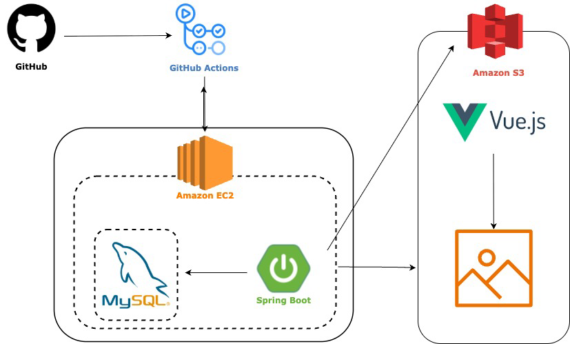

# 📌 BoardLab 프로젝트

## 프로젝트 소개

BoardLab은 온라인 커뮤니티에서 자주 활용되는 게시판 기능을 보다 직관적이고 효율적으로 제공하기 위해 기획된 웹 서비스입니다.
단순한 글 작성·조회 기능을 넘어, 사용자 친화적인 UI/UX와 안정적인 데이터 관리 구조를 기반으로 누구나 손쉽게 글을 작성하고 소통할 수 있도록 설계하였습니다.

- 개발 기간 : 2025. 06 ~ 진행 중
   
   

## 🏗 Architecture

### System Architecture

---

## ⚙ Tech Stack

### **Back-End**

  
  
  
  
  
  
  
    

- Java 17
- Spring Boot 3.5.3
- MySQL (운영·개발 환경)
- H2 Database (테스트 환경)
- Spring Security
- JWT
- Postman
- Swagger API 문서화

---

### **Infra**

  
  
  

- AWS EC2 (Ubuntu)
- AWS S3
- GitHub Actions

---

### **Version Control**

  
  

#### **Git Branch Strategy**

- **main**: 배포용 브랜치
- **dev**: 메인 개발 브랜치  
