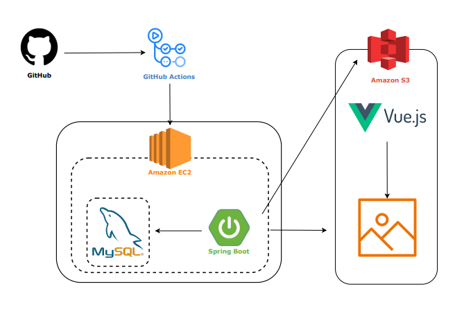

# 📌 나의 게시판 프로젝트

---

## 🏗 Architecture

### System Architecture

<!-- 시스템 아키텍처 그림 크기 조정 -->

  

---

## ⚙ Tech Stack

### **Back-End**

 

- Java 17
- Spring Boot 3.5.3
- MySQL (운영·개발 환경)
- H2 Database (테스트 환경)
- Spring Security
- JWT
- Postman

---

### **Infra**

- AWS EC2 (Ubuntu)
- GitHub Actions

---

### **Version Control**

#### **Git Branch Strategy**

- **main**
    - 배포용 브랜치
- **dev**
    - 메인 개발 브랜치

